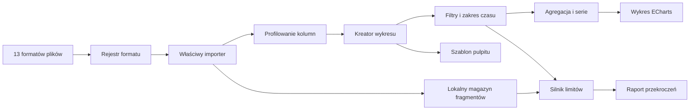

# Eyes of Odin — przewodnik aplikacji i projektu

Ten dokument wyjaśnia sposób korzystania z Eyes of Odin 0.1.0 oraz pokazuje, gdzie znajduje się każda mechanika. Jest przeznaczony zarówno dla użytkownika aplikacji, jak i osoby rozwijającej projekt.

## 1. Czym jest Eyes of Odin

Eyes of Odin to lokalna przestrzeń do eksplorowania danych i sprawdzania konsekwencji zmian. Użytkownik może wczytać plik tekstowy, JSON, skoroszyt albo Parquet, zbudować kilka powiązanych wizualizacji, zawęzić dane do wybranego czasu, ustawić bezpieczne granice oraz modelować warianty „co, jeśli…”.

Wersja 0.1.0 działa bez konta. Dane nie są przesyłane do zewnętrznej usługi.

## 2. Główne obszary interfejsu

### Strona główna

Po uruchomieniu aplikacja pokazuje spokojny ekran startowy zamiast całego edytora. Z tego miejsca można:

- wczytać własny plik,
- kontynuować lokalnie zapisaną przestrzeń,
- otworzyć gotowy pulpit demonstracyjny,
- przejść bezpośrednio do modelowania scenariusza.

Pełne panele robocze pojawiają się dopiero po wybraniu zadania. Kliknięcie logo lub pozycji **Start** przywraca stronę główną bez usuwania pracy.

### Model

Model jest wizualnym grafem zależności. Elementy można dodawać, zaznaczać, przenosić i łączyć w ścieżkę prowadzącą od danych do wyniku.

Przyciski **Eksplorator**, **Inspektor** i **Wyniki** pozwalają odzyskać miejsce na graf. Inspektor i panel wyników są domyślnie schowane. Ustawienie zostaje zapamiętane lokalnie. Panel wyników można dodatkowo powiększyć przyciskiem w jego prawym górnym rogu.

Typy elementów:

- **Źródło** — wczytany plik lub zestaw wejściowy,
- **Transformacja** — etap przygotowania albo przeliczenia danych,
- **Decyzja** — wybór zmieniający przebieg scenariusza,
- **Metryka** — obliczana wartość kontrolna,
- **Wynik** — końcowy rezultat ścieżki.

### Data Studio

Data Studio odpowiada za wczytywanie i podgląd danych. Pokazuje liczbę rekordów, kolumny, rozpoznane typy oraz pierwsze wiersze.

Obsługiwane formaty i limity:

- CSV, TSV i TXT: do 500 MB i 2 000 000 rekordów; separator TSV jest tabulatorem, a CSV/TXT jest rozpoznawany automatycznie,
- JSON: do 100 MB i 2 000 000 rekordów; obsługiwana jest tablica obiektów, pojedynczy obiekt lub obiekt `{ "data": [...] }`,
- JSONL i NDJSON: do 500 MB i 2 000 000 rekordów, odczyt wiersz po wierszu,
- XLS, XLSX, XLSM, XLSB, ODS i FODS: do 50 MB i 250 000 rekordów; przed importem można wybrać arkusz,
- Parquet: do 2 GB i 2 000 000 rekordów, z lokalnym odczytem zakresów pliku i popularnych metod kompresji.

Zagnieżdżone obiekty i tablice JSON/Parquet są zachowywane w komórce jako tekst JSON. Nieprawidłowy JSONL/NDJSON zgłasza dokładny numer wiersza. Import zakończony błędem usuwa wszystkie fragmenty rozpoczętego zbioru.

Podczas importu można użyć przycisku **Anuluj** albo klawisza `Esc`. Proces roboczy jest wtedy natychmiast zatrzymywany, a częściowo zapisane fragmenty są usuwane. Jeśli odczyt nie rozpocznie się lub lokalny magazyn jest zablokowany, aplikacja kończy oczekiwanie i pokazuje możliwy do naprawienia komunikat zamiast pozostawiać modal na 0%.

Duże zestawy są dzielone na fragmenty. Do interfejsu trafia reprezentatywna próbka, natomiast dane potrzebne raportom mogą zostać zapisane lokalnie w IndexedDB.

### Visual Lab

Visual Lab domyślnie pokazuje wyłącznie pulpit i najważniejsze sterowanie układem. Kreator otwiera się w wysuwanym panelu po użyciu **Nowy wykres** albo **Edytuj**, dzięki czemu konfiguracja nie zabiera stale miejsca wykresom. Dla każdego wykresu można ustawić:

- nazwę i typ wizualizacji,
- pole osi X,
- jedną lub kilka wartości Y,
- agregację: suma, średnia, minimum, maksimum lub liczba rekordów,
- podział na serie,
- porównanie z inną wartością,
- zwykły filtr danych,
- zakres czasu od–do,
- dolny i górny limit,
- rozmiar kafelka.

Każdy kafelek pokazuje ostatnią wartość, średnią i zakres. Rzadziej używane działania — kolejność, rozmiar, duplikowanie i usuwanie — znajdują się w menu `•••`.

#### Zakres czasu od–do

Jeżeli plik zawiera kolumnę rozpoznaną jako data, w kreatorze pojawia się sekcja **Zakres czasu**.

1. Wybierz kolumnę, najczęściej `Timestamp`.
2. Ustaw pole **Od**, pole **Do** albo oba.
3. Podgląd i zapisany wykres pokażą wyłącznie rekordy z tego przedziału.

Zakres jest częścią definicji wykresu. Zostaje zachowany podczas duplikowania wykresu, zapisywania pulpitu i eksportowania szablonu.

### Limity i raport

Limit może kontrolować każdą wybraną serię Y. Przykładowy zakres 90–110 oznacza:

- wartość `< 90` — zdarzenie poniżej limitu,
- wartość `> 110` — zdarzenie powyżej limitu,
- 90 i 110 — wartości dopuszczalne.

Tryb **wartość widoczna na wykresie** analizuje wynik agregacji. Tryb **każdy rekord źródłowy** sprawdza surowe wiersze, również te przechowywane poza próbką ekranu.

Raport grupuje kolejne przekroczenia w zdarzenia i podaje:

- czas rozpoczęcia i zakończenia,
- liczbę punktów,
- minimum i maksimum,
- największe odchylenie,
- dokładne rekordy składające się na zdarzenie.

### Układy i szablony

Pulpit może prezentować 1, 4, 9 albo własną liczbę wykresów. Przy większej liczbie wykresów dostępne są kolejne strony pulpitu.

Szablon zapisuje:

- układ pulpitu,
- kolejność i wielkości kafelków,
- osie i serie,
- filtry oraz zakresy czasu,
- porównania,
- limity kontrolne.

Podczas używania szablonu z innym plikiem aplikacja próbuje dopasować nazwy kolumn. Nierozpoznane pola wymagają jawnego wskazania odpowiednika.

### Ścieżki i porównanie scenariuszy

Ścieżki przedstawiają kolejność decyzji, np. `1 → 4 → 9`. Wariant może zmieniać cenę, marketing, konwersję oraz wybory w poszczególnych punktach. Widok porównania pokazuje różnice między wariantem aktywnym i bazowym. Przycisk **Eksportuj raport** zapisuje aktualne porównanie do pliku CSV.

### Sterowanie przestrzenią roboczą

- `Ctrl+B` — pokaż lub ukryj Eksplorator,
- `Ctrl+J` — pokaż lub ukryj panel wyników,
- `Ctrl+K` — otwórz paletę poleceń,
- `Esc` — zamknij aktywne okno albo anuluj import,
- ikona koła zębatego — ustawienia widoczności paneli,
- przycisk `?` — skróty, informacje o wersji i prywatności.

Ustawienia mają cztery kategorie:

- **Wygląd** — motyw Odin Dark, Midnight lub Graphite, kolor akcentu, gęstość i ograniczenie animacji,
- **Język i format** — polski albo angielski; wybór wpływa również na format liczb i dat,
- **Przestrzeń robocza** — widoczność paneli i przyciąganie bloków do siatki,
- **Aplikacja** — wersja, informacja o lokalnym przetwarzaniu i przejście do najnowszego wydania.

Model Studio udostępnia **Uporządkuj**, aby ułożyć graf warstwowo, oraz ikonę dopasowania obok powiększenia. Nowy blok zawsze otrzymuje wolne miejsce. Starszy zapis jest automatycznie porządkowany tylko wtedy, gdy zawiera nakładające się elementy; poprawne ręczne układy pozostają bez zmian.

## 3. Przykładowy proces pracy

1. Otwórz jeden z plików w `data/ready/5-minutes`.
2. Wybierz `Timestamp` jako oś X.
3. Wybierz `Seal1_Heat1_Process_Value` jako Y.
4. Ustaw zakres czasu na część tygodnia.
5. Dodaj limit od 90 do 110 w trybie surowych rekordów.
6. Zapisz wykres, a następnie dodaj kolejne kanały.
7. Wybierz układ 4 lub 9.
8. Zapisz pulpit jako szablon i wyeksportuj go do pliku.
9. Otwórz raport przekroczeń i zapisz wynik jako CSV.

## 4. Architektura i foldery

```text
src/
  app/
    EyesOfOdin.tsx        stan przestrzeni roboczej i główny układ
    i18n/                 słowniki językowe i formatowanie regionalne
    settings/             trwałe preferencje oraz centrum ustawień
    views/HomeView.tsx    ekran startowy i wybór sposobu pracy
    styles/app.css        kompletny wygląd aplikacji
  desktop/
    index.html            dokument startowy Vite
    main.tsx              uruchomienie React
  mechanics/
    charts/
      components/         kreator, renderer, pulpit, raport i szablony
      engine/             agregacje, filtry, zakres czasu i limity
      reports/            raportowanie pełnych danych z IndexedDB
      templates/          zapis i dopasowanie szablonów
      types/              kontrakty wykresów i raportów
    data/
      importers/          rejestr oraz import tekstu, JSON, arkuszy i Parquet
      storage/            lokalny magazyn fragmentów danych
      workers/            kontrolowany odczyt plików tekstowych i skoroszytów poza głównym wątkiem
      types/              limity i kontrakty importu
    modeling/
      engine/             obliczenia wariantów scenariusza
      layout/             kolizje, wolne miejsca i automatyczny układ grafu
      types/              graf, decyzje i wyniki scenariuszy
src-tauri/                natywne okno, ikony i konfiguracja instalatora
data/ready/               gotowe zestawy CSV/XLSX oraz opis schematu
scripts/                  uruchamianie, instalacja i kontrola jakości
tests/                    testy mechanik i struktury wydania
releases/0.1.0/           instalator, portable i sumy SHA-256
```

## 5. Przepływ danych



## 6. Najważniejsze mechaniki w kodzie

- `dataFormatForFile(...)` rozpoznaje jeden z 13 formatów w centralnym rejestrze.
- `importDataFile(...)` wybiera importer tekstowy, JSON, skoroszytów albo Parquet.
- `importDelimitedFile(...)` czyta CSV, TSV i TXT fragmentami oraz raportuje postęp.
- `importJsonFile(...)` obsługuje dokumenty JSON i strumieniowe JSONL/NDJSON.
- `importWorkbookFile(...)` uruchamia worker, wybiera arkusz i dzieli rekordy na fragmenty.
- `importParquetFile(...)` odczytuje metadane, a następnie kolejne zakresy rekordów bez ładowania całego pliku.
- `buildChartDataset(...)` stosuje zakres czasu, filtry, agregację i serie.
- `passesTimeRange(...)` sprawdza granice od–do.
- `buildThresholdReport(...)` tworzy raport dla aktualnie dostępnych danych.
- `buildStoredRawThresholdReport(...)` analizuje pełny zestaw zapisany lokalnie.
- `createDashboardTemplate(...)` tworzy przenośny układ pulpitu.
- `applyTemplateToDataset(...)` dopasowuje szablon do nowego pliku.
- `calculateScenario(...)` oblicza wynik aktywnego wariantu.

## 7. Zapis lokalny

Przestrzeń robocza, scenariusze, wykresy i szablony są zapisywane w `localStorage` pod kluczem `eyes-of-odin-workspace-v1`. Układ paneli używa osobnego klucza `eyes-of-odin-ui-v1`. Fragmenty dużych zbiorów trafiają do IndexedDB w bazie `eyes-of-odin-data-v1`.

Usunięcie danych przeglądarki lub magazynu aplikacji usuwa lokalnie zapisany stan. Importowany plik źródłowy nie jest modyfikowany.

## 8. Rozwijanie projektu

### Nowy typ wykresu

1. Dodaj typ do `ChartType`.
2. Dodaj wybór w `ChartBuilder.tsx`.
3. Zaimplementuj przygotowanie danych w `chart-engine.ts`.
4. Zarejestruj odpowiedni moduł ECharts w `ChartRenderer.tsx`.
5. Dodaj test regresji.

### Nowy format danych

1. Dodaj importer w `src/mechanics/data/importers`.
2. Rozszerz `DatasetFormat` i `supportedDataFile(...)`.
3. Zachowaj kontrakt `ImportedDataset`.
4. Dodaj mały plik testowy i przypadek błędu.

### Nowa mechanika modelowania

Czyste obliczenia należy umieścić w `src/mechanics/modeling/engine`, a ich typy w `modeling/types`. Główny komponent powinien jedynie przekazywać stan i prezentować wynik.

Rozmieszczanie elementów należy rozwijać w `src/mechanics/modeling/layout`. Funkcje są deterministyczne i testowane na grafie 25 elementów. Interfejs może wywołać `layoutModelGraph`, `findVacantNodePosition` i `getGraphBounds`, ale nie powinien samodzielnie powielać zasad geometrii.

### Publikowanie wydania GitHub

1. Upewnij się, że `package.json`, `src-tauri/tauri.conf.json` i tag mają ten sam numer.
2. Wypchnij tag, np. `v0.1.0`.
3. `.github/workflows/release.yml` uruchomi pełną kontrolę jakości i kompilację Tauri.
4. `scripts/package-release.ps1` przygotuje instalator, portable oraz `SHA256SUMS.txt`.
5. Workflow utworzy GitHub Release, z którego korzysta `scripts/install.ps1` oraz przycisk pobierania w README.

Wydanie można także przygotować lokalnie poleceniem `pnpm release:package`.

## 9. Kontrola jakości

Podstawowa komenda:

```powershell
pnpm quality
```

Pełna kontrola na Windows:

```powershell
powershell -ExecutionPolicy Bypass -File scripts/quality.ps1
```

Zakres kontroli:

- TypeScript `tsc --noEmit`,
- ESLint,
- testy jednostkowe Node,
- produkcyjny build Vite,
- Rust `cargo fmt --check`,
- Rust `cargo clippy -D warnings`,
- Ruff i mypy, gdy repozytorium zawiera kod Python.

## 10. Najczęstsze problemy

### Kolumna czasu nie pojawia się w kreatorze

Sprawdź, czy wartości mają jednoznaczny format daty, najlepiej ISO 8601, np. `2026-07-01T12:30:00Z`.

### Szablon zgłasza brakujące pola

Nazwy w nowym pliku różnią się od zapisanych. W oknie dopasowania wybierz odpowiednik każdej brakującej kolumny.

### Budowa instalatora nie działa

Zainstaluj Rust oraz Microsoft Visual Studio Build Tools z modułem „Desktop development with C++”. Następnie uruchom ponownie `pnpm desktop:build`.

### Wykres używa próbki danych

Dla bardzo dużego pliku interfejs pokazuje ograniczoną próbkę w celu zachowania płynności. Raport limitów w trybie surowym analizuje fragmenty zapisane lokalnie, a nie tylko próbkę.
